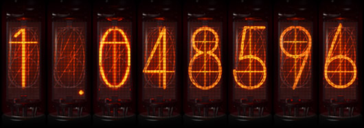
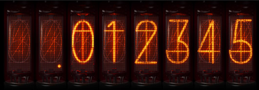

# Divergence Meter
Android divergence meter widget like that in Steins;Gate.

#### Features
- Displaying divergence number in nixie tubes;
- Changing the divergence every 2 hours;
- Balanced random system, that lowers the chance of going to a new worldline;
- Ability to set your own divergence number.

#### Images
Normal view:

With minus:

#### Known issues
- For unknown reasons, widget can display error message "Problem loading widget". Fix: delete and add the widget again.
- There is -1.000000 divergence which would be displayed as -.000000